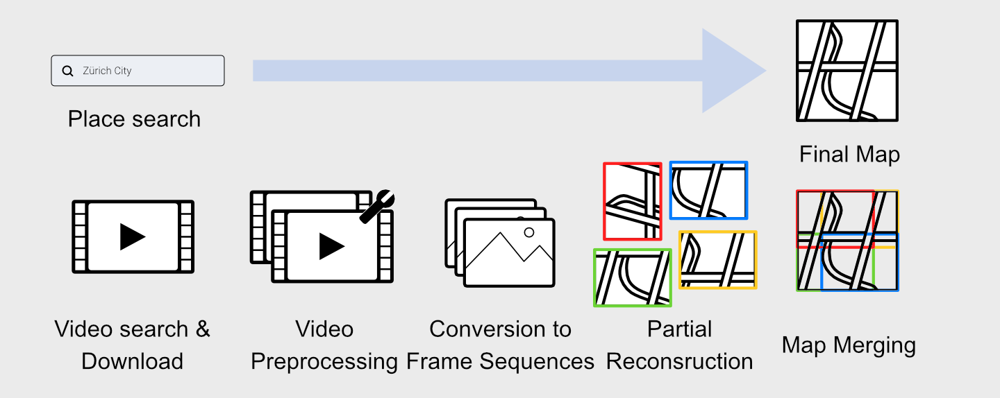
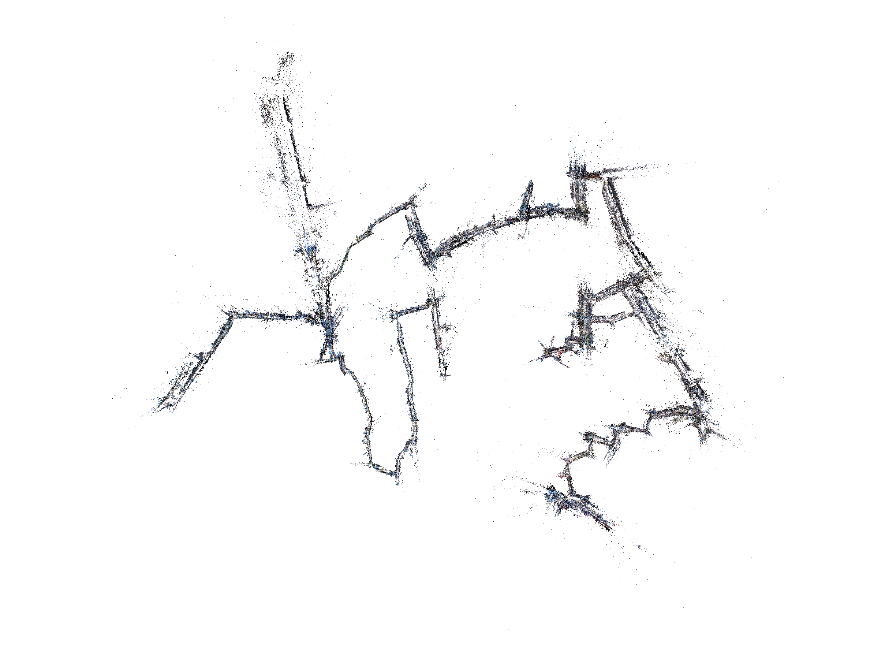
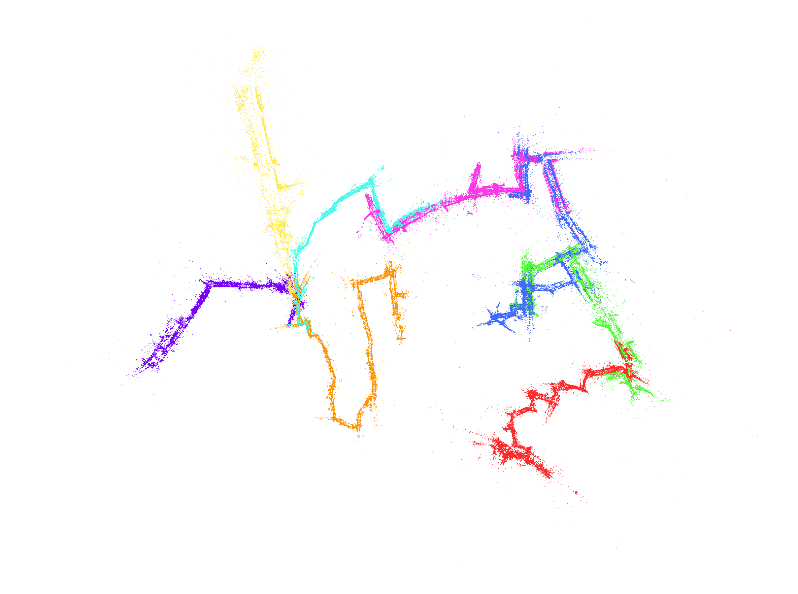

# ZüriCity-SLAM
## Introduction

This project presents a pipeline to reconstruct cities from
publicly available YouTube videos. The pipeline is built upon [hloc](https://github.com/cvg/Hierarchical-Localization) and COLMAP.




## Result excerpts

Example of merged reconstructions from the video [2obsKLoZQdU](https://www.youtube.com/watch?v=2obsKLoZQdU)


 

## Prerequisites
Project is created with
* Python: 3.7

## Set up
Clone this repository:
```
$ git clone --recursive git@gitlab.ethz.ch:z-ricityslam/zuricityslam.git
$ git submodule update --init --recursive
```

Install hloc-fork
```
$ cd hloc_fork
$ pip3 install -r requirements.txt
$ python3 -m pip install -e .
$ cd ..
```

Install required python packages, if they are not already installed:
```
$ pip3 install -r requirements.txt
```
**NB! ffmpeg also needs to be installed for preprocessing**

Then run
```
$ pip3 install -e .
```
to install cityslam


### Videointerface Youtube API Key
To use the videointerface you need a Youtube API Key, follow this guide:
[getting started](https://developers.google.com/youtube/v3/getting-started)

## Run this project

### Run simple demo of cityslam pipeline
Run the `demo_pipeline.ipynb` notebook


## Run cityslam

### To run the intermediate steps of the pipeline

#### Find videos for a given query
```
$ python3 -m cityslam.videointerface.videointerface --query zurich
```

#### Download videos
```
$ python3 -m cityslam.videointerface.downloader --output $VIDEO_PATH --video_ids W25QdyiFnh0 ...
```

#### Preprocessing
```
$ python3 -m cityslam.preprocessing.preprocessing --videos $VIDEO_PATH --output $IMAGES_PATH
```

#### Mapping
```
$ python3 -m cityslam.mapping.reconstruction --dataset $SINGLE_VIDEO_PATH
```

#### Merging
```
$ python3 -m cityslam.localization.merge --models $MODELS_PATH --graphs $MERGE_PATH
```

## Folder structure

```
./
├── datasets
│   ├── images
│   ├── image_splits
│   ├── queries
│   ├── transitions
│   ├── transitions_cropped
│   ├── videos
│   └── videos_wv
└── outputs
    ├── graph
    ├── merge
    └── models
```

Each main folder typically contain a separate folder / file for each video, named after video id, i.e. `W25QdyiFnh0`.

## Description of modules 

### videointerface

- videointerface.py: The video interface module takes in a city name and queries the YouTube API for relevant videos. These videos are ranked and returned based on relevance.

- downloader.py: Downloads a list of youtube videos to datasets/videos. 

### Preprocessing
- transitions.py: Takes care of dividing the videos into scenes based on transitions and length. To do the transition detection we use [TransNetV2
](https://github.com/soCzech/TransNetV2/). The output of the transition detection is a txt file placed in datasets/transitions/ that contain the start and end frame of each scene. The other output of this file is datasets/transitions_cropped which is the same as transitions but too short scenes are removed and too long ones are split up into shorter ones. The lists in transitions_cropped is also scaled by fps. 

- preprocessing.py: Extracts frames for a list of videos at a given fps and places them in datasets/images.

- create_img_list.py: Create a list of which images that are to be included in each scene. Also lets you specify how much overlap you want between sequential scenes. Outputs a txt file in outputs/image_splits

- transnetv2_pytorch.py: Class used in transtions detection. Downloaded from [here](https://github.com/soCzech/TransNetV2/tree/master/inference-pytorch). All credit to github.com/soCzech.

### Mapping 

- reconstruction.py: This module creates a reconstruction for a given image list. First it extracts global features, and find image pairs either via sequential pairing, image retrieval or both. Afterwards it extracts and matches local features. And lastly reconstructs a model using pycolmap which is placed in outputs/models.

### Localization
- find_model_pairs.py: Find potential model matches and creates a json file containing model match scores, which can be used for more efficient merging
- abs_pose_estimation.py: Tries to find a transformation between two models
- helper_functions.py: RANSAC algorithm and more
- merge.py: Tries to merge all models 


### hloc_fork
- We forked HLoc as some parts fit better within HLoc, we added
- pairs_from_sequential.py: generate sequential pairs, optionally with retrieval as well
- pairs_from_retrieval_resampling.py: Run retrieval routine with resampling to find better pairs


## Further improvements

- More robust model merging
- faster reconstruction by switching out COLMAP with COLMAPSLAM
- pose graph optimization of merged models